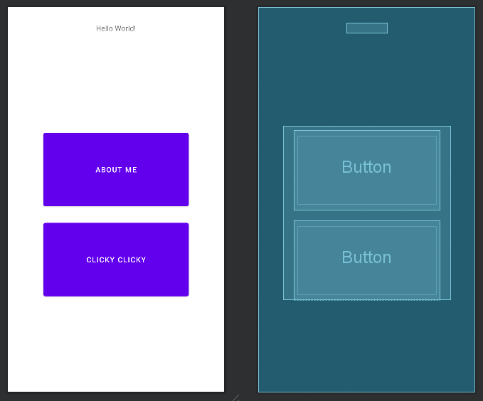

# Assignment 3 - Clicky Clicky

The goal of this assignment was to implement an updated version of the app 
submitted in Assignment 1 to now include another activity that would consist of
buttons arranged in a grid pattern. 

This was done using a singe ConstrainedLayout to better understand and learn 
building constraints. A simpler solution could have been a ConstrainedLayout
nested within another ConstrainedLayout to more easily handle the constraints.

## Main Activity

The main activity has now been fixed in regards to alignment.

--

## Clicky Clicky Activity

The activity layout was designed around one of the button centered on the page 
and the other elements aligning themselves in relation to the center element.

--

