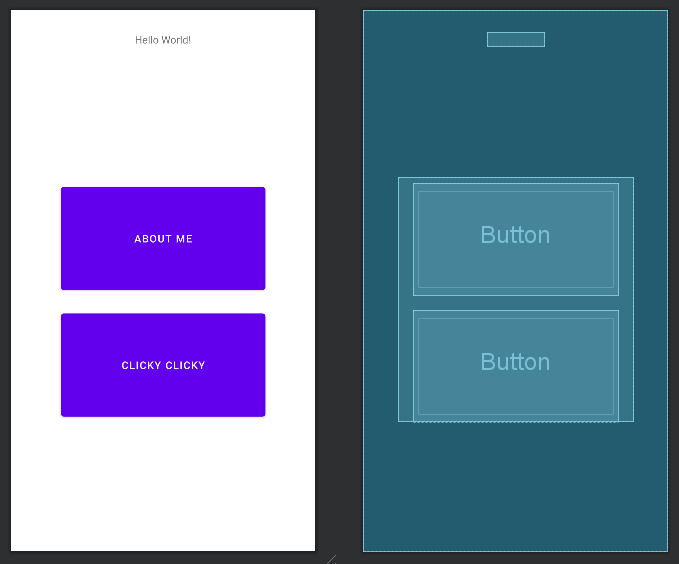
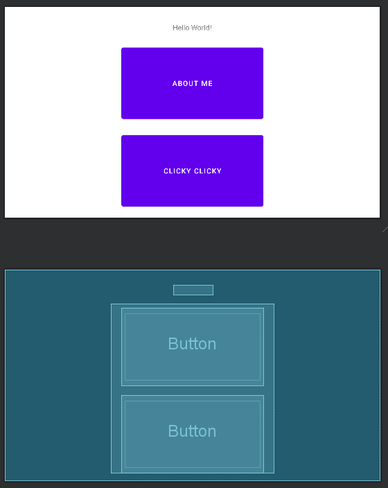
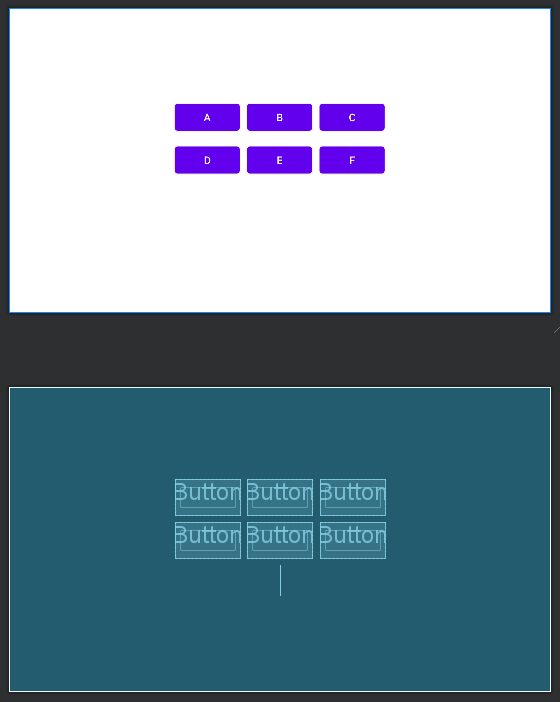

# Assignment 7 - Location Confirmed

The goal of this assignment was to implement an updated version of the app
submitted in Assignment 5 to now include another activity that would show the current location of
the user and track the amount of distance traveled.

## Main Activity

The main activity has now been fixed in regards to alignment.

--

## Location Confirmed Activity

The activity layout was designed around one of the button centered on the page
and the other elements aligning themselves in relation to the center element.

--

